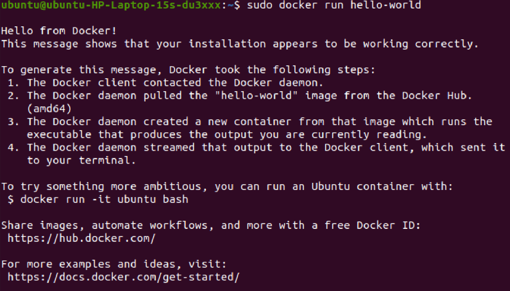

### Set up the repository
1. Update the apt package index and install packages to allow apt to use a repository over HTTPS:

       sudo apt-get update
       sudo apt-get install \
          ca-certificates \
          curl \
          gnupg \
          lsb-release
2. Add Docker’s official GPG key:

        curl -fsSL https://download.docker.com/linux/ubuntu/gpg | sudo gpg --dearmor -o /usr/share/keyrings/docker-archive-keyring.gpg
        
3. Use the following command to set up the stable repository. To add the nightly or test repository, add the word nightly or test (or both) after the word stable in the commands below. Learn about nightly and test channels.

       echo \
        "deb [arch=$(dpkg --print-architecture) signed-by=/usr/share/keyrings/docker-archive-keyring.gpg] https://download.docker.com/linux/ubuntu \
        $(lsb_release -cs) stable" | sudo tee /etc/apt/sources.list.d/docker.list > /dev/null
        
### Install Docker Engine

1. Update the apt package index, and install the latest version of Docker Engine, containerd, and Docker Compose, or go to the next step to install a specific version:

       sudo apt-get update
       sudo apt-get install docker-ce docker-ce-cli containerd.io docker-compose-plugin

2. To install a specific version of Docker Engine, list the available versions in the repo, then select and install:
   - List the versions available in your repo:

         apt-cache madison docker-ce
   - Install a specific version using the version string from the second column, for example, 5:18.09.1~3-0~ubuntu-xenial.

         sudo apt-get install docker-ce=<VERSION_STRING> docker-ce-cli=<VERSION_STRING> containerd.io docker-compose-plugin

3. Verify that Docker Engine is installed correctly by running the hello-world image.

       sudo docker run hello-world

